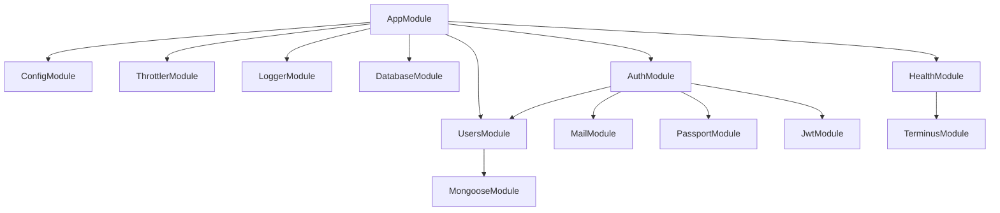
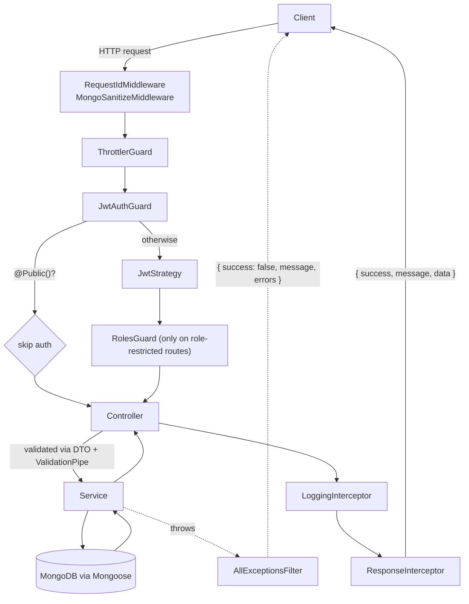

# Architecture

## NestJS concepts used in this project

If you're new to NestJS, here's what each building block means before diving into the diagrams below:

- **Module** (`@Module()`) — a group of related controllers/providers (e.g. `AuthModule`, `UsersModule`). Nest builds a dependency graph of modules at startup.
- **Controller** (`@Controller()`) — defines HTTP routes. Takes input, delegates to a service, formats nothing itself (see [error-handling.md](./error-handling.md) for how responses actually get their final shape).
- **Provider / Service** (`@Injectable()`) — a class that does the actual work (business logic, data access). Nest's **Dependency Injection (DI)** container creates and wires these automatically: if `AuthController` declares `constructor(private authService: AuthService)`, Nest supplies an instance without any manual `new AuthService()`.
- **DTO** (Data Transfer Object) — a plain class describing the shape of a request body, annotated with `class-validator` decorators. The global `ValidationPipe` (configured in `src/main.ts`) validates every incoming request against its DTO before the controller method runs.
- **Guard** (`implements CanActivate`) — runs _before_ a route handler and decides whether the request is allowed through (used for authentication/authorization).
- **Strategy** (Passport) — a pluggable authentication mechanism; this project uses one Passport strategy (`JwtStrategy`) invoked by `JwtAuthGuard`.
- **Interceptor** (`implements NestInterceptor`) — wraps around a handler's execution; can transform the response on the way out (this project uses it to log requests and to apply the response envelope) or the request on the way in.
- **Exception Filter** (`@Catch()`) — catches errors thrown anywhere in the request pipeline and turns them into an HTTP response.
- **Middleware** — plain Express-style functions that run before routing even resolves a controller (used here for request-ID tagging and input sanitization).

## Layers and responsibilities

| Layer                | Example in this repo                                     | Responsibility                                                                                            |
| -------------------- | -------------------------------------------------------- | --------------------------------------------------------------------------------------------------------- |
| Middleware           | `RequestIdMiddleware`, `MongoSanitizeMiddleware`         | Runs on every request, before routing. Tags/sanitizes; no business logic.                                 |
| Guard                | `JwtAuthGuard`, `RolesGuard`                             | Allow or reject a request before the controller runs.                                                     |
| Strategy             | `JwtStrategy`                                            | Verifies a credential (JWT) and resolves it to a user identity.                                           |
| Controller           | `AuthController`, `ProfileController`, `UsersController` | Declares routes, validates input via DTOs, calls exactly one service method, returns `{ message, data }`. |
| DTO                  | `RegisterDto`, `LoginDto`, ...                           | Declares and validates the shape of a request body. Never contains logic.                                 |
| Service              | `AuthService`, `UsersService`                            | All business logic: hashing, token issuance, lockout policy, orchestrating other services.                |
| Schema / Data access | `User` schema, `UsersService`                            | Defines what's persisted and is the only code that queries the database directly.                         |
| Interceptor          | `ResponseInterceptor`, `LoggingInterceptor`              | Transforms the response envelope; logs the request/response cycle.                                        |
| Exception Filter     | `AllExceptionsFilter`                                    | Catches anything thrown anywhere and formats a safe error response.                                       |

**Why `AuthService` and `UsersService` are separate:** `UsersService` is a plain data-access layer for the `User` collection — a repository. `AuthService` is business logic: password hashing, token issuance/rotation, lockout policy, orchestrating `MailService`. Keeping them apart means any other module that just needs "find a user by id" doesn't pull in authentication concerns.

## Module dependency graph

## Request flow through the layers

This matches the actual global registration in `src/app.module.ts`: `ThrottlerGuard` and `JwtAuthGuard` are registered as `APP_GUARD` providers (in that order), `LoggingInterceptor` and `ResponseInterceptor` as `APP_INTERCEPTOR`, and `AllExceptionsFilter` as `APP_FILTER`. `RolesGuard` is **not** global — it's applied per-controller with `@UseGuards(RolesGuard)` (currently only on `UsersController`).

See [request-lifecycle.md](./request-lifecycle.md) for a step-by-step walkthrough of this same diagram.
