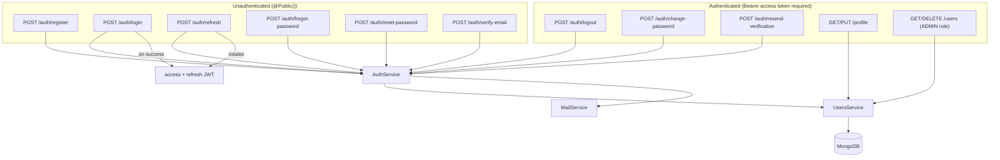

# Authentication Flow — Overview

This is the map of every authentication-related flow in the system. Each section links to a dedicated document with the full detail (files touched, sequence diagrams, security reasoning); this page is the index plus a quick per-flow summary table.

| #   | Flow                    | Endpoint                                                    | Auth required           | Detail                                                                                               |
| --- | ----------------------- | ----------------------------------------------------------- | ----------------------- | ---------------------------------------------------------------------------------------------------- |
| 1   | Registration            | `POST /auth/register`                                       | No                      | [registration-flow.md](./registration-flow.md)                                                       |
| 2   | Login                   | `POST /auth/login`                                          | No                      | [login-flow.md](./login-flow.md)                                                                     |
| 3   | Access token generation | (part of login/refresh)                                     | —                       | [jwt-token-flow.md](./jwt-token-flow.md)                                                             |
| 4   | Protected API request   | any non-`@Public()` route                                   | Yes                     | [request-lifecycle.md](./request-lifecycle.md)                                                       |
| 5   | JWT Guard execution     | `JwtAuthGuard`                                              | —                       | [jwt-token-flow.md](./jwt-token-flow.md), [authorization-and-roles.md](./authorization-and-roles.md) |
| 6   | JWT Strategy execution  | `JwtStrategy.validate()`                                    | —                       | [jwt-token-flow.md](./jwt-token-flow.md)                                                             |
| 7   | Current user resolution | `@CurrentUser()`                                            | —                       | [authorization-and-roles.md](./authorization-and-roles.md)                                           |
| 8   | Refresh token flow      | `POST /auth/refresh`                                        | No (token in body)      | [refresh-token-flow.md](./refresh-token-flow.md)                                                     |
| 9   | Refresh token rotation  | (part of refresh)                                           | —                       | [refresh-token-flow.md](./refresh-token-flow.md)                                                     |
| 10  | Logout                  | `POST /auth/logout`                                         | Yes                     | [refresh-token-flow.md](./refresh-token-flow.md) (Logout invalidation section)                       |
| 11  | Password change         | `POST /auth/change-password`                                | Yes                     | [password-management.md](./password-management.md)                                                   |
| 12  | Forgot password         | `POST /auth/forgot-password`                                | No                      | [password-management.md](./password-management.md)                                                   |
| 13  | Reset password          | `POST /auth/reset-password`                                 | No                      | [password-management.md](./password-management.md)                                                   |
| 14  | Email verification      | `POST /auth/verify-email`, `POST /auth/resend-verification` | verify: No: resend: Yes | [registration-flow.md](./registration-flow.md)                                                       |

## The full picture

## Reading order for this section

If you're learning the authentication system for the first time, read in this order:

1. [jwt-token-flow.md](./jwt-token-flow.md) — what a JWT is and this project's payload/signing/verification.
2. [registration-flow.md](./registration-flow.md) and [login-flow.md](./login-flow.md) — how an account and a session are created.
3. [refresh-token-flow.md](./refresh-token-flow.md) — how a session stays alive, and how theft is detected.
4. [authorization-and-roles.md](./authorization-and-roles.md) — how routes are protected and restricted by role.
5. [password-management.md](./password-management.md) and [profile-flow.md](./profile-flow.md) — the remaining self-service flows.

For what happens to a request at the framework level (middleware → guards → controller → interceptors), see [request-lifecycle.md](./request-lifecycle.md).
