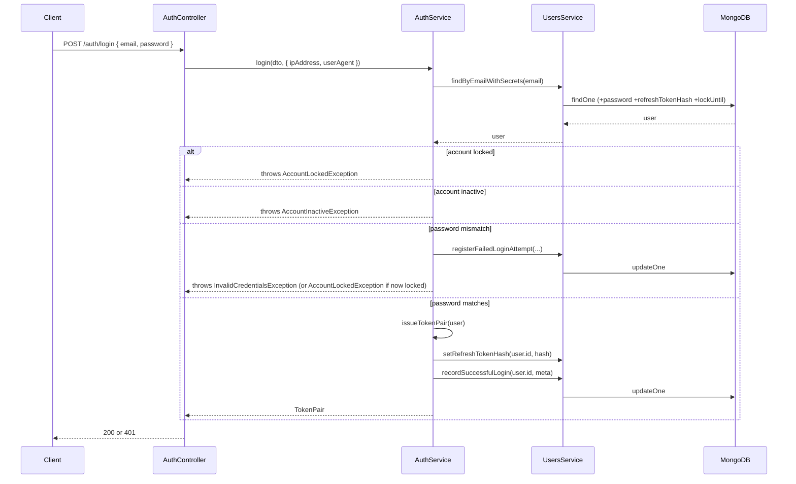

# Login Flow

**Endpoint:** `POST /api/v1/auth/login` — `@Public()` (no token required)

```
Client
  ↓
POST /auth/login  { email, password }
  ↓
AuthController.login()  (also captures @Ip() and the User-Agent header)
  ↓
LoginDto validation
  ↓
AuthService.login()
  ↓
UsersService.findByEmailWithSecrets()   — fetch user WITH password/lockUntil/failedLoginAttempts
  ↓ (found)
check lockUntil > now?  → AccountLockedException
  ↓ (not locked)
check isActive?  → AccountInactiveException
  ↓ (active)
bcrypt.compare(password, user.password)
  ↓                                  ↓
 match                          no match
  ↓                                  ↓
issueTokenPair()          registerFailedLoginAttempt()
  ↓                                  ↓
recordSuccessfulLogin()      locked now? → AccountLockedException
  ↓                          otherwise    → InvalidCredentialsException
API Response:
{ accessToken, refreshToken, expiresIn, tokenType: 'Bearer' }
```

## Files involved

| Concern                           | File                                                                                         |
| --------------------------------- | -------------------------------------------------------------------------------------------- |
| Route                             | `src/auth/auth.controller.ts` (`login`)                                                      |
| Request validation                | `src/auth/dto/login.dto.ts`                                                                  |
| Business logic                    | `src/auth/auth.service.ts` (`login`, `issueTokenPair`)                                       |
| User lookup (with secrets)        | `src/users/users.service.ts` (`findByEmailWithSecrets`)                                      |
| Password comparison               | `src/common/utils/password.util.ts` (`compareValue`)                                         |
| Failed-attempt tracking / lockout | `src/users/users.service.ts` (`registerFailedLoginAttempt`)                                  |
| Successful-login bookkeeping      | `src/users/users.service.ts` (`recordSuccessfulLogin`)                                       |
| Token issuance                    | `src/auth/auth.service.ts` (`issueTokenPair`) — see [jwt-token-flow.md](./jwt-token-flow.md) |
| Response DTO shape                | `src/auth/dto/auth-response.dto.ts`                                                          |

## Order of checks, and why

`AuthService.login()` checks lock status and active status **before** comparing the password:

1. Does the user exist? (`findByEmailWithSecrets`)
2. Is `lockUntil` set and in the future? → reject immediately, no bcrypt call.
3. Is `isActive` false? → reject immediately.
4. Only then: `bcrypt.compare()`.

This ordering matters for two reasons: it avoids an expensive bcrypt comparison (deliberately slow, by design) for accounts that are going to be rejected anyway, and it lets the error message be specific (locked vs. inactive vs. wrong credentials) — while still keeping the _unknown email_ and _wrong password_ cases indistinguishable (both throw `InvalidCredentialsException` with the same "Invalid email or password" message), so a caller can't use this endpoint to discover which emails have accounts.

## Account lockout

On a wrong password, `UsersService.registerFailedLoginAttempt()` increments `failedLoginAttempts`. Once it reaches `ACCOUNT_LOCK_MAX_ATTEMPTS` (default 5), it sets `lockUntil` to `now + ACCOUNT_LOCK_DURATION_MINUTES` (default 15 minutes). Both are configurable via environment variables — see [environment-configuration.md](./environment-configuration.md).

This is a _per-account_ defense, independent of the global IP-based rate limiter (`ThrottlerGuard`, configured via `THROTTLE_TTL`/`THROTTLE_LIMIT`). An attacker spreading login attempts across many IP addresses would evade the rate limiter but still trip the per-account lockout.

`lockUntil` is cleared automatically on the next successful login (`recordSuccessfulLogin` uses `$unset: { lockUntil: '' }`), not via a scheduled job — there's no need to eagerly unlock an account nobody is currently trying to use.

## Login history

On success, `recordSuccessfulLogin` also:

- Sets `lastLogin` to now and increments `loginCount`.
- Appends `{ timestamp, ipAddress, userAgent }` to the `loginHistory` array, capped at the most recent 20 entries via MongoDB's `$slice: -20` (so the array can't grow unbounded).

## Sequence diagram


