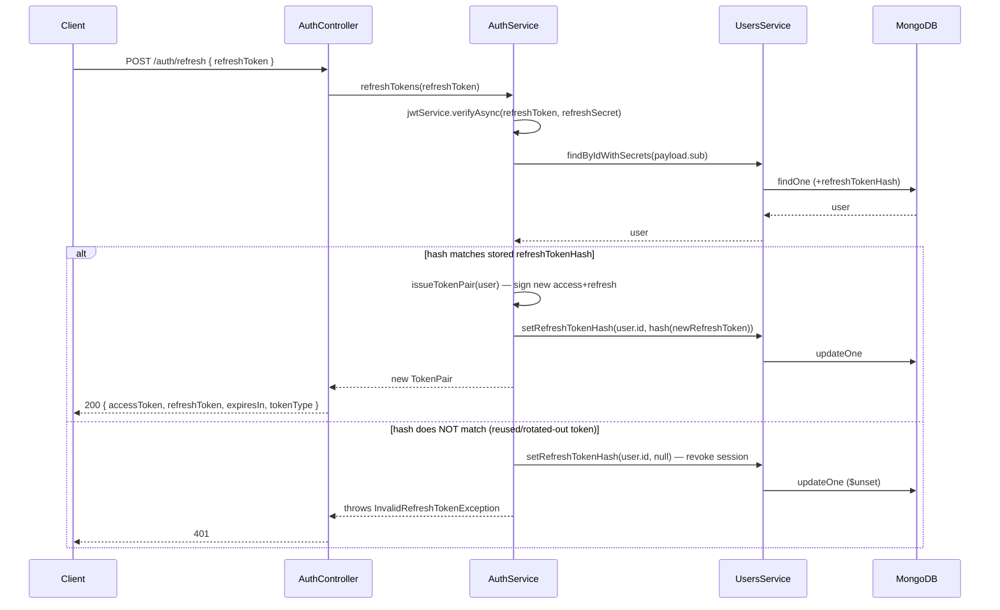

# Refresh Token Flow

## Why refresh tokens exist

Access tokens are short-lived (15 minutes by default) so that a stolen one is only useful briefly. But a 15-minute session would mean users re-entering their password constantly. The refresh token solves this: it's long-lived (7 days by default) and has exactly one job — exchange itself for a new access token, without the user re-authenticating. See [jwt-token-flow.md](./jwt-token-flow.md) for how both tokens are signed.

## Why refresh tokens are stored (and hashed, not raw)

The server needs to be able to _revoke_ a refresh token — on logout, on password change, or when it detects reuse of an already-rotated token (below). A JWT's signature check alone can't be revoked (it's stateless by design), so the server keeps a side-channel: it stores something on the `User` document (`refreshTokenHash`, in `src/users/schemas/user.schema.ts`) that it can check against on every refresh attempt, and clear when it wants to invalidate the session.

**Why hashed, not the raw token:** the same reason passwords are never stored in plaintext. If the database ever leaks, an attacker with the raw refresh tokens could impersonate every user until each token naturally expires (up to 7 days). Storing only a hash means the leaked data alone is useless — the attacker would still need to reverse the hash, which for a hash of high-entropy random data is not practical.

The hashing itself is plain SHA-256 (`src/common/utils/crypto.util.ts`), **not** bcrypt:

```ts
export function hashToken(token: string): string {
  return createHash('sha256').update(token).digest('hex');
}
```

This is a deliberate difference from password hashing. Bcrypt's slowness exists to defend against brute-forcing a _low-entropy, human-chosen_ password. A refresh token is 256 bits of `crypto.randomBytes`-equivalent entropy (it's a signed JWT) — there's nothing to brute-force, so a fast, deterministic hash is sufficient and avoids unnecessary CPU cost on every refresh request.

## Verifying a refresh attempt

`AuthService.refreshTokens()` (`src/auth/auth.service.ts`):

```ts
const payload = await this.jwtService.verifyAsync<JwtPayload>(refreshToken, {
  secret: this.jwt.refreshSecret,
});
// ...
if (hashToken(refreshToken) !== user.refreshTokenHash) {
  await this.usersService.setRefreshTokenHash(user.id, null);
  throw new InvalidRefreshTokenException();
}
```

Two independent checks have to pass:

1. **Signature and expiry**, verified by `jwtService.verifyAsync` against `JWT_REFRESH_SECRET` — this is the same cryptographic check any JWT gets.
2. **Hash match** against the value stored on the user's document — this is what makes rotation (below) actually enforceable, since the JWT signature check alone can't tell "this specific token" from "a token that used to be valid."

## Rotation

Every successful refresh **replaces** the stored hash with a new one — the just-used refresh token becomes invalid immediately, even though it hasn't expired yet:

```ts
const tokens = await this.issueTokenPair(user); // signs new tokens, and...
// ...issueTokenPair() ends with:
await this.usersService.setRefreshTokenHash(user.id, hashToken(refreshToken));
```

This means a refresh token is effectively single-use. The client is expected to store the _new_ refresh token from the response and discard the old one.

## Reuse detection

What happens if someone tries to reuse a refresh token that's already been rotated out? The hash comparison above fails — `hashToken(oldToken) !== <hash of the current token>` — and the code does **not** just reject that one request:

```ts
if (hashToken(refreshToken) !== user.refreshTokenHash) {
  await this.usersService.setRefreshTokenHash(user.id, null); // revoke the whole session
  throw new InvalidRefreshTokenException();
}
```

It clears `refreshTokenHash` entirely, revoking the _entire_ session — including whatever token _is_ currently valid. This is a deliberate, stricter posture: a hash mismatch on an otherwise-valid, unexpired JWT most plausibly means the token was stolen and someone (attacker or legitimate user) already rotated it elsewhere. Since there's no reliable way to tell attacker-reuse apart from a legitimate client retrying a request with a stale token, the safe default is to kill the session and require the real user to log in again.



## Logout invalidation

`AuthService.logout()` simply clears the stored hash:

```ts
async logout(userId: string): Promise<void> {
  await this.usersService.setRefreshTokenHash(userId, null);
}
```

There's nothing to "invalidate" on the _access_ token itself (JWTs are stateless and remain technically valid until they expire) — logout's real effect is that the refresh token can no longer be exchanged for a new one, so the session effectively ends once the current access token expires (at most `JWT_ACCESS_EXPIRATION`, 15 minutes by default) rather than continuing for up to 7 days.

**Implementation note on `$unset` vs `$set: undefined`:** `UsersService.setRefreshTokenHash()` uses MongoDB's `$unset` operator to clear the field:

```ts
const update =
  refreshTokenHash === null
    ? { $unset: { refreshTokenHash: '' } }
    : { $set: { refreshTokenHash } };
```

This matters more than it looks: MongoDB's driver silently drops `undefined` values from an update document, so `$set: { refreshTokenHash: undefined }` would be a **no-op** — the field would never actually get cleared. This was a real bug found and fixed during this project's implementation (see the "Important Findings" section the assistant reports after documentation work) — logout appeared to succeed but didn't actually revoke the token until `$unset` was used instead.
