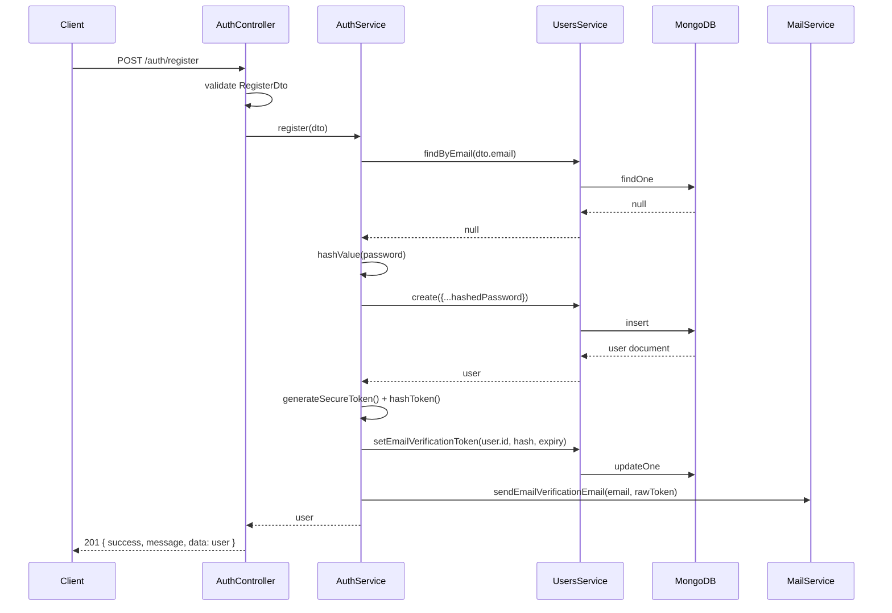

# Registration Flow

**Endpoint:** `POST /api/v1/auth/register` — `@Public()` (no token required)

```
Client
  ↓
POST /auth/register  { firstName, lastName, email, password }
  ↓
AuthController.register()
  ↓
RegisterDto validation (class-validator, via global ValidationPipe)
  ↓
AuthService.register()
  ↓
UsersService.findByEmail()          — check for an existing account
  ↓ (not found)
hashValue(password, bcryptSaltRounds)  — bcrypt hash, never store plaintext
  ↓
UsersService.create()                — persist the user (role defaults to USER)
  ↓
issueEmailVerificationToken()        — generate + hash a verification token, store it, email it (stub)
  ↓
API Response: { success: true, message: "Registration successful...", data: <user, password/hashes stripped> }
```

## Files involved

| Concern                | File                                                                        |
| ---------------------- | --------------------------------------------------------------------------- |
| Route                  | `src/auth/auth.controller.ts` (`register`)                                  |
| Request validation     | `src/auth/dto/register.dto.ts`                                              |
| Business logic         | `src/auth/auth.service.ts` (`register`)                                     |
| Password strength rule | `src/common/constants/validation.constants.ts` (`STRONG_PASSWORD_REGEX`)    |
| Password hashing       | `src/common/utils/password.util.ts` (`hashValue`)                           |
| Duplicate-email check  | `src/users/users.service.ts` (`findByEmail`)                                |
| Persistence            | `src/users/users.service.ts` (`create`), `src/users/schemas/user.schema.ts` |
| Verification token     | `src/common/utils/crypto.util.ts` (`generateSecureToken`, `hashToken`)      |
| Email (stub)           | `src/mail/mail.service.ts`                                                  |

## Details worth knowing

- **Email normalization**: the email is lowercased and trimmed in `UsersService.create()`, on top of the schema's own `lowercase: true`. This means `Jane@Example.com` and `jane@example.com` are treated as the same account.
- **Duplicate detection has two layers**: `findByEmail` is checked first (fast, friendly error), but the real guarantee against a race condition (two concurrent registrations with the same email) is the schema's `unique: true` index on `email` — a database-level constraint, not just an application-level check.
- **Password strength** is enforced by `@Matches(STRONG_PASSWORD_REGEX)` on `RegisterDto.password`: at least 8 characters, one uppercase, one lowercase, one digit, one special character.
- **The response never contains the password** — the schema's `toJSON` transform (`src/users/schemas/user.schema.ts`) strips `password` and every token-hash field before any document is serialized, regardless of which controller returns it.
- **Default role is `USER`** — there is no way to register as `ADMIN` through this endpoint (or any endpoint). See `docs/database-and-schema.md` and the root README for how the first `ADMIN` account is created instead (the seed script).
- **Registration does not require email verification up front** — the account is created immediately with `isEmailVerified: false`. See `docs/authentication-flow.md` for what (if anything) depends on that flag in this codebase.

## Sequence diagram


