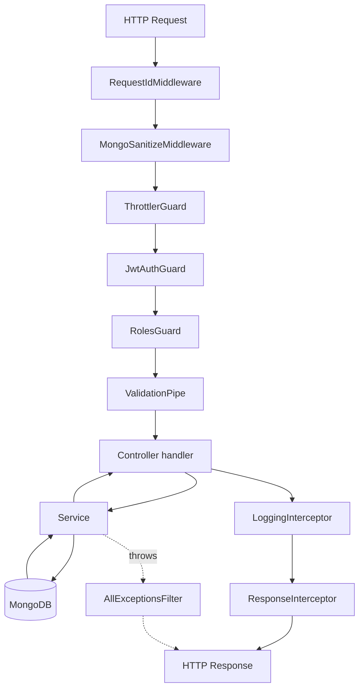

# Request Lifecycle

What actually happens, in order, when a request hits this application. Every step below corresponds to real, currently-registered code — nothing here is aspirational.

## Step by step

1. **`RequestIdMiddleware`** (`src/common/middlewares/request-id.middleware.ts`) — applied to every route (`consumer.apply(...).forRoutes('*')` in `app.module.ts`). Generates a UUID, attaches it to `req.id`, and echoes it as the `X-Request-Id` response header. Every later log line for this request includes that ID.

2. **`MongoSanitizeMiddleware`** (`src/common/middlewares/mongo-sanitize.middleware.ts`) — recursively strips any object key starting with `$` or containing `.` from `req.body`, `req.params`, and `req.query`. Without this, a body like `{ "email": { "$gt": "" } } ` could be interpreted by Mongoose as a query operator rather than a literal value.

3. **`ThrottlerGuard`** (registered globally via `APP_GUARD` in `app.module.ts`) — rate-limits by IP using the `THROTTLE_TTL`/`THROTTLE_LIMIT` env vars. Runs before authentication so a request flood is rejected cheaply, without a database lookup.

4. **`JwtAuthGuard`** (`src/common/guards/jwt-auth.guard.ts`, also global) — requires a valid access token **unless** the route is decorated `@Public()`. Internally, this delegates to Passport's `AuthGuard('jwt')`, which runs `JwtStrategy.validate()` (see [jwt-token-flow.md](./jwt-token-flow.md)). On success, `request.user` is populated with an `AuthenticatedUser` (`{ userId, email, role }`).

5. **`RolesGuard`** (`src/common/guards/roles.guard.ts`) — **not global**. Only applied where a controller has `@UseGuards(RolesGuard)` and `@Roles(...)` (currently just `UsersController`). Reads `request.user.role` (populated by the step above) and compares it against the roles required by `@Roles(...)`.

6. **`ValidationPipe`** (registered globally in `src/main.ts`) — validates the request body against its DTO's `class-validator` decorators. Configured with:
   - `whitelist: true` — strips any property not declared on the DTO.
   - `forbidNonWhitelisted: true` — rejects the request (400) if it contained an undeclared property, rather than silently dropping it. This is what makes `PUT /profile` reject an `email` field instead of ignoring it.
   - `transform: true` — converts the plain JSON body into an actual instance of the DTO class.

7. **Controller handler** — e.g. `AuthController.login()`. Calls exactly one service method and returns `{ message, data }`.

8. **Service** — e.g. `AuthService.login()`. All business logic and database calls happen here.

9. **`LoggingInterceptor`** then **`ResponseInterceptor`** (`src/common/interceptors/`, both global `APP_INTERCEPTOR`s) — run on the way _out_. `LoggingInterceptor` logs one line (`METHOD path status - duration`). `ResponseInterceptor` wraps the controller's `{ message, data }` return value into `{ success: true, message, data }`. A route marked `@RawResponse()` (currently just `/health`) skips this wrapping.

10. **`AllExceptionsFilter`** (`src/common/filters/all-exceptions.filter.ts`, global `APP_FILTER`) — if anything above throws, this is the single place that catches it and formats `{ success: false, message, errors }`. See [error-handling.md](./error-handling.md) for the full mapping of exception types to HTTP statuses.

## What's intentionally _not_ in this pipeline

- There is no session/cookie middleware — authentication is entirely stateless via the `Authorization: Bearer <token>` header (see [jwt-token-flow.md](./jwt-token-flow.md)).
- `helmet()` and `compression()` are applied directly on the Express app in `src/main.ts` (not as Nest middleware/guards), so they run at the Express layer before Nest's own pipeline even starts.
